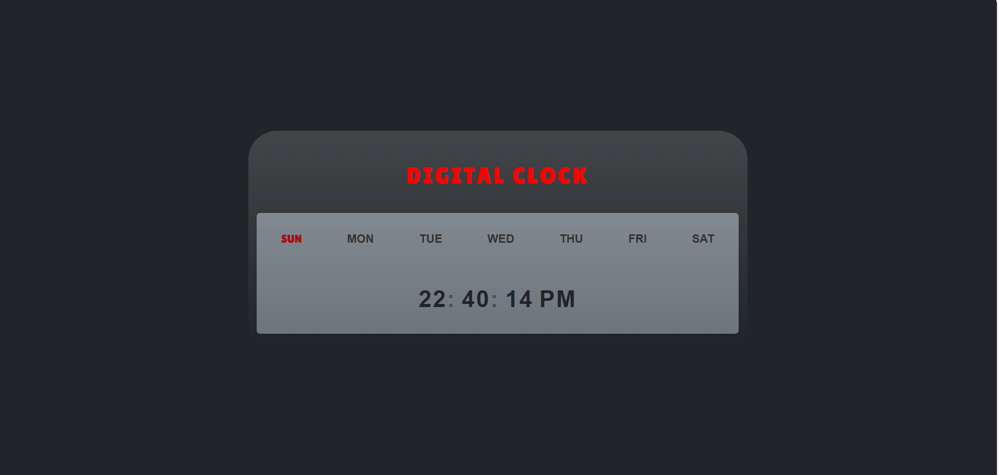

# ⏰ Digital Clock – HTML, CSS, & JavaScript

This is a **Digital Clock** built using **HTML**, **CSS**, and **JavaScript**. The project displays the current time, updates every second, and shows the active day of the week. The clock is responsive and styled to look modern with a clean user interface.

---

## 🔗 Live Demo

👉 [Click here to view the live site](https://your-username.github.io/digital-clock/)  

---

## 📌 Features

- Real-time clock that updates every second
- Displays the current **day of the week**, **hours**, **minutes** and **seconds**
- 12-hour format with **AM/PM** toggle
- Active day of the week is highlighted
- Simple, clean, and modern design with CSS styling
- Fully responsive design to fit all screen sizes
- **CSS Animations** for the blinking dots between hours, minutes, and seconds

---

## 💡 Purpose

This project was built to:
- Practice using **JavaScript** to manipulate **Date** objects and update the DOM in real-time.
- Implement **CSS animations** to add interactive visual effects.
- Create a **responsive** layout using **CSS Flexbox** and ensure it works well on all devices.
- Learn to style a **digital clock** with minimalistic design and user-friendly interface.

---

## 🛠️ Technologies Used

- **HTML5**
- **CSS3** (Flexbox, Animations)
- **JavaScript** (Date, DOM manipulation)

---

## 📸 Screenshot
()  
---

